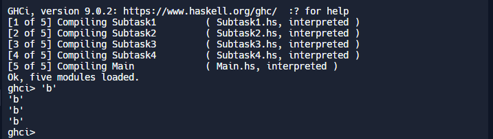
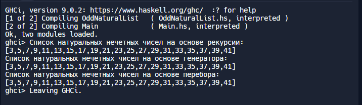
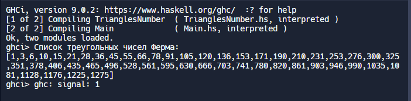
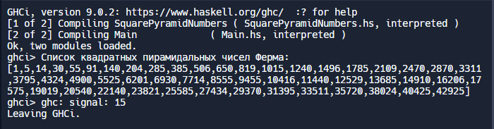

1) Используя функции fst (возвращает первый элемент кортежа)  и snd (возвращвет второй элемент кортежа из 2 элементов)  из стандартного модуля Prelude чтобы "достать" значение типа Char из кортежа (( 1, 'a'), "abc")
-------------------------------------------------
Main.hs
-------------------------------------------------
```
main = do
  let inputCortege = ((1, 'a'), "abc")
  let getChar cortege = snd (fst cortege)
  print (getChar inputCortege)
```


2) Используя функции head и tail  получить элемент b из списков
-------------------------------------------------
Main.hs
-------------------------------------------------
```
module Main where
import qualified Subtask1 as ST1
import qualified Subtask2 as ST2
import qualified Subtask3 as ST3
import qualified Subtask4 as ST4

main = do
  let inputList1 = ['a', 'b', 'c']
  print (ST1.getCharB inputList1)

  let inputList2 = [['a', 'b'], ['c','d']]
  print (ST2.getCharB inputList2)

  let inputList3 = [['a', 'c', 'd'], ['a','b']]
  print (ST3.getCharB inputList3)

  let inputList4 = [['a','d'], ['b', 'c']]
  print (ST4.getCharB inputList4)
```
-------------------------------------------------
Subtask1.hs
-------------------------------------------------
```
module Subtask1 where
  getCharB list = head (tail list)
```
-------------------------------------------------
Subtask2.hs
-------------------------------------------------
```
module Subtask2 where
  getCharB list = head (tail (head list))
```
-------------------------------------------------
Subtask3.hs
-------------------------------------------------
```
module Subtask3 where
  getCharB list = head( tail (head (tail list)))
```
-------------------------------------------------
Subtask4.hs
-------------------------------------------------
```
module Subtask4 where
  getCharB list = head (head (tail list))
```
-------------------------------------------------


3) Список нечётных натуральных чисел.  Количество чисел в списке = 20. (не менее 3 способа)
-------------------------------------------------
Main.hs
-------------------------------------------------
```
module Main where

import qualified OddNaturalList as ONL

main = do
  let startElement = 2
  let numberElement = 20

  putStrLn "Список натуральных нечетных чисел на основе рекурсии:"
  if startElement `mod` 2 == 1
    then print (ONL.oddNaturalListWithRecursive startElement numberElement)
    else print (ONL.oddNaturalListWithRecursive (startElement + 1) numberElement)

  putStrLn "Список натуральных нечетных чисел на основе генератора:"
  if startElement `mod` 2 == 1
    then print (ONL.oddNaturalListWithGenerator startElement numberElement)
    else print (ONL.oddNaturalListWithGenerator (startElement + 1) numberElement)

  let list = []
  putStrLn "Список натуральных нечетных чисел на основе перебора:"
  if startElement `mod` 2 == 1
    then print (ONL.oddNaturalListWithIterating startElement numberElement list)
    else print (ONL.oddNaturalListWithIterating (startElement + 1) numberElement list)
```
-------------------------------------------------
OddNaturalList.hs
-------------------------------------------------
```
module OddNaturalList where

oddNaturalListWithRecursive :: Int -> Int -> [Int]
oddNaturalListWithRecursive startElement numberElement =
  if numberElement > 0
    then startElement : oddNaturalListWithRecursive (startElement + 2) (numberElement - 1)
    else []

oddNaturalListWithGenerator :: Int -> Int -> [Int]
oddNaturalListWithGenerator startElement numberElement = 
  [startElement, startElement + 2 .. startElement + 2 * numberElement - 1]

oddNaturalListWithIterating :: Int -> Int -> [Int] -> [Int]
oddNaturalListWithIterating startElement numberElement emptyList = 
  if numberElement > 0 && startElement `mod` 2 == 1 then 
    emptyList ++ [startElement] ++ oddNaturalListWithIterating (startElement + 1) (numberElement - 1) emptyList
  else 
    if numberElement > 0 then
      oddNaturalListWithIterating (startElement + 1) (numberElement) emptyList
    else []
```
-------------------------------------------------


4) Список треугольных чисел Ферма. Колво чисел = 50.
-------------------------------------------------
Main.hs
-------------------------------------------------
```
module Main where

import qualified TrianglesNumber as TN

main = do
  let startElement = 1
  let numberElements = 50
  let list = []

  putStrLn "Список треугольных чисел Ферма:"
  print (TN.getTrianglesNumberWithLimit startElement numberElements list)
```
-------------------------------------------------
TrianglesNumber.hs
-------------------------------------------------
```
module TrianglesNumber where

getTrianglesNumberWithLimit :: Int -> Int -> [Int] -> [Int]
getTrianglesNumberWithLimit startElement numberElements list =
  if numberElements > 0 then
    list ++ [startElement * (startElement + 1) `div` 2] ++ getTrianglesNumberWithLimit (startElement + 1) (numberElements - 1) list
  else 
    []
```
-------------------------------------------------


5) Список пирамидальных чисел Ферма. Колво чисел = 50
-------------------------------------------------
Main.hs
-------------------------------------------------
```
module Main where

import qualified SquarePyramidNumbers as SPN

main = do
  let startElement = 1
  let numberElements = 50
  let list = []

  putStrLn "Список квадратных пирамидальных чисел Ферма:"
  print (SPN.getSquarePyramidNumbersWithLimit startElement numberElements list)
```
-------------------------------------------------
SquarePyramidNumbers.hs
-------------------------------------------------
```
module SquarePyramidNumbers where

getSquarePyramidNumbersWithLimit :: Int -> Int -> [Int] -> [Int]
getSquarePyramidNumbersWithLimit startElement numberElements list =
  if numberElements > 0 then
    list ++ [startElement * (startElement + 1) * (2 * startElement + 1) `div` 6] ++ getSquarePyramidNumbersWithLimit (startElement + 1) (numberElements - 1) list
  else 
    []
```
-------------------------------------------------

