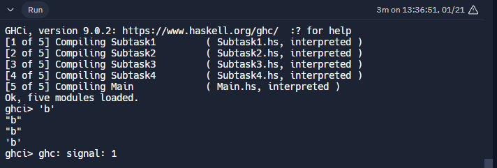

Main.hs
-------------------------------------------------
module Main where
import qualified Subtask1 as ST1
import qualified Subtask2 as ST2
import qualified Subtask3 as ST3
import qualified Subtask4 as ST4

main = do
  let inputList1 = ['a', 'b', 'c']
  print (ST1.getCharB inputList1)

  let inputList2 = [['a', 'b'], ['c','d']]
  print (ST2.getCharB inputList2)

  let inputList3 = [['a', 'c', 'd'], ['a','b']]
  print (ST3.getCharB inputList3)

  let inputList4 = [['a','d'], ['b', 'c']]
  print (ST4.getCharB inputList4)
-------------------------------------------------
Subtask1.hs
-------------------------------------------------
module Subtask1 where
  getCharB list = head (tail list)
-------------------------------------------------
Subtask2.hs
-------------------------------------------------
module Subtask2 where
  getCharB list = tail (head list)
-------------------------------------------------
Subtask3.hs
-------------------------------------------------
module Subtask3 where
  getCharB list = tail (head (tail list))
-------------------------------------------------
Subtask4.hs
-------------------------------------------------
module Subtask4 where
  getCharB list = head (head (tail list))
-------------------------------------------------
