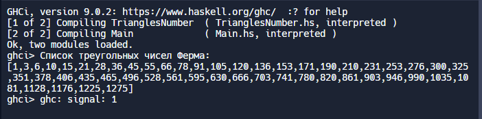

Main.hs
-------------------------------------------------
module Main where

import qualified TrianglesNumber as TN

main = do
  let startElement = 1
  let numberElements = 50
  let list = []

  putStrLn "Список треугольных чисел Ферма:"
  print (TN.getTrianglesNumberWithLimit startElement numberElements list)
-------------------------------------------------
TrianglesNumber.hs
-------------------------------------------------
module TrianglesNumber where

getTrianglesNumberWithLimit :: Int -> Int -> [Int] -> [Int]
getTrianglesNumberWithLimit startElement numberElements list =
  if numberElements > 0 then
    list ++ [startElement * (startElement + 1) `div` 2] ++ getTrianglesNumberWithLimit (startElement + 1) (numberElements - 1) list
  else 
    []
-------------------------------------------------
