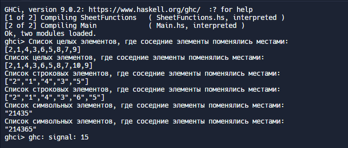

----------------------------
Main.hs
----------------------------
'''
module Main where

import qualified SheetFunctions as SF

main = do
  let listIntOdd = [1, 2, 3, 4, 5, 6, 7, 8, 9]
  let listIntEven = [1, 2, 3, 4, 5, 6, 7, 8, 9, 10]
  let listStringOdd = ["1", "2", "3", "4", "5"]
  let listStringEven = ["1", "2", "3", "4", "5", "6"]
  let listCharOdd = ['1', '2', '3', '4', '5']
  let listCharEven = ['1', '2', '3', '4', '5', '6']

  putStrLn "Список целых элементов, где соседние элементы поменялись местами:"
  print (SF.oddEven listIntOdd)

  putStrLn "Список целых элементов, где соседние элементы поменялись местами:"
  print (SF.oddEven listIntEven)

  putStrLn "Список строковых элементов, где соседние элементы поменялись местами:"
  print (SF.oddEven listStringOdd)

  putStrLn "Список строковых элементов, где соседние элементы поменялись местами:"
  print (SF.oddEven listStringEven)

  putStrLn "Список символьных элементов, где соседние элементы поменялись местами:"
  print (SF.oddEven listCharOdd)

  putStrLn "Список символьных элементов, где соседние элементы поменялись местами:"
  print (SF.oddEven listCharEven)
'''
----------------------------
SheetFunctions.hs
----------------------------
'''
module SheetFunctions where

oddEven :: [v] -> [v]
oddEven [] = []
oddEven [x] = [x]
oddEven (x:y:xs) = y:x:oddEven xs
'''

