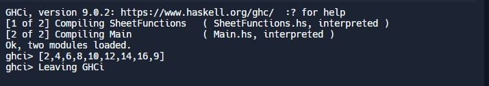

----------------------------
Main.hs
----------------------------
'''
module Main where

import qualified SheetFunctions as SF

main = do
  let list1 = [1, 2, 3, 4, 5, 6, 7, 8, 9]
  let list2 = [1, 2, 3, 4, 5, 6, 7, 8]

  print (SF.listSumm list1 list2)
'''
----------------------------
SheetFunctions.hs
----------------------------
'''
module SheetFunctions where

listSumm :: [Int] -> [Int] -> [Int]
listSumm [][] = []
listSumm  =(n1:nx)
listSumm (l1:lx)[] = (l1:lx)
listSumm (l1:lx) (n1:nx) = l1 + n1: (listSumm lx nx )
'''
