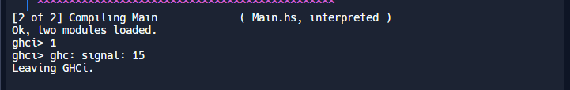

----------------------------
Main.hs
----------------------------
'''
module Main where

import qualified SheetFunctions as SF

main = do
  let list1 = [1, 2, 3, 4, 2, 6, 7, 8, 9]

  print (SF.position list1 2)
'''
----------------------------
SheetFunctions.hs
----------------------------
'''
module SheetFunctions where

position :: [a] -> a -> Integer
position l a = positionN a l 0

positionN :: a -> [a] -> Integer -> Integer
positionN j (a:t) n = (n + 1)
positionN a (h:t) n = positionN a t (n+1)
positionN a [] n = 0
'''
