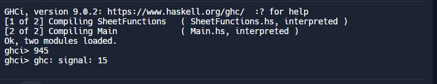

----------------------------
Main.hs
----------------------------
'''
module Main where

import qualified SheetFunctions as SF

main = do
  print (SF.sumFormule 10 1)

'''
----------------------------
SheetFunctions.hs
----------------------------
'''
module SheetFunctions where

sumFormule :: Int -> Int -> Int
sumFormule n i
  | i <= n = n * n - i + sumFormule n (i + 1)
  | otherwise = 0
'''
